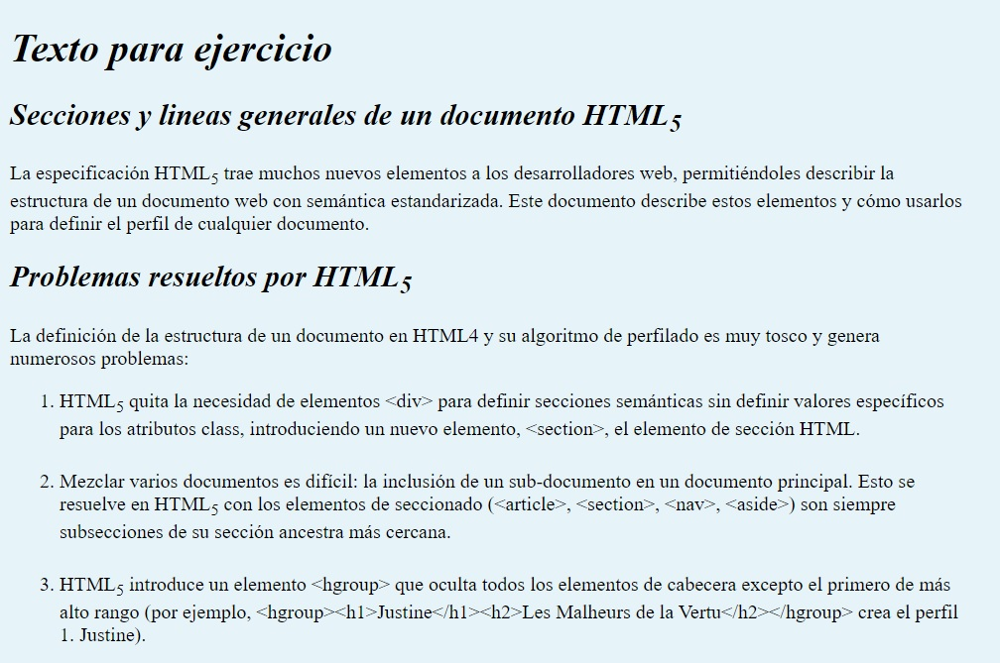
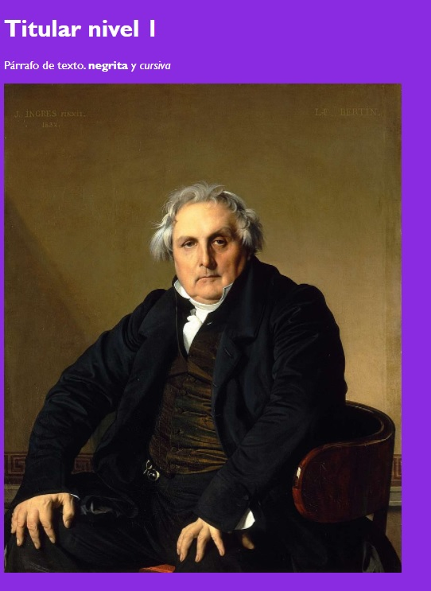
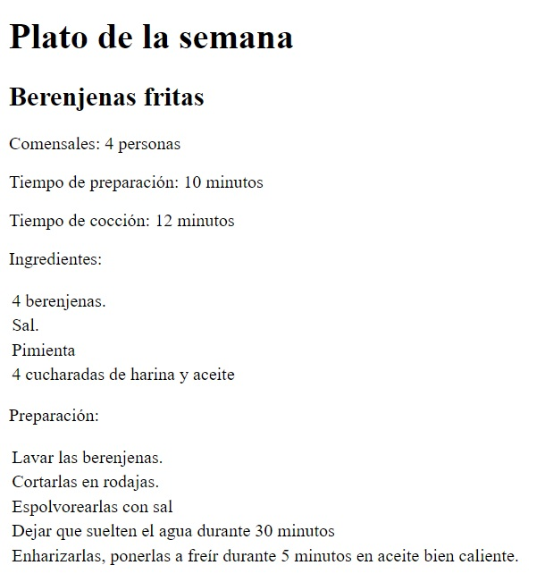
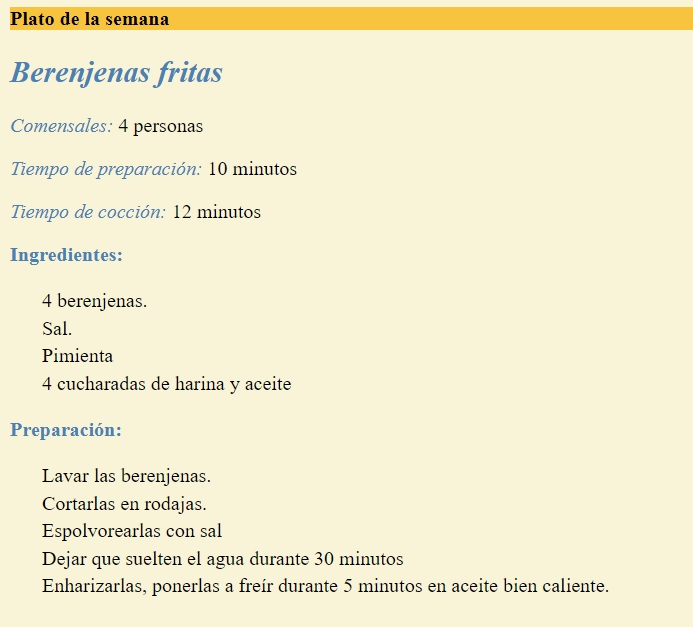
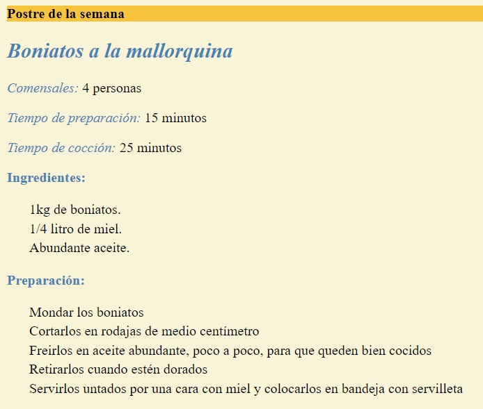
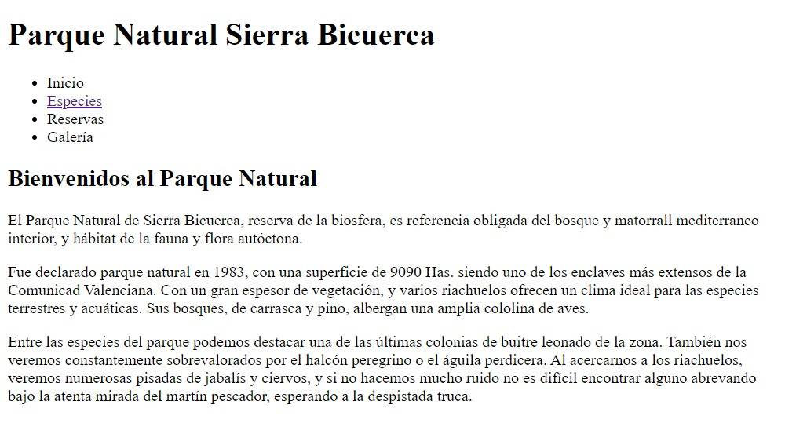
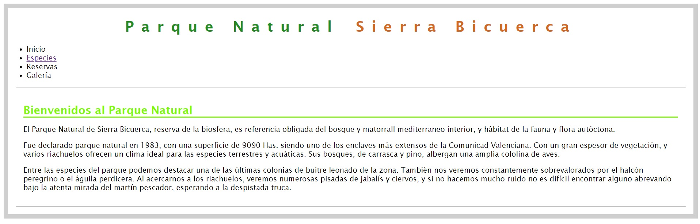
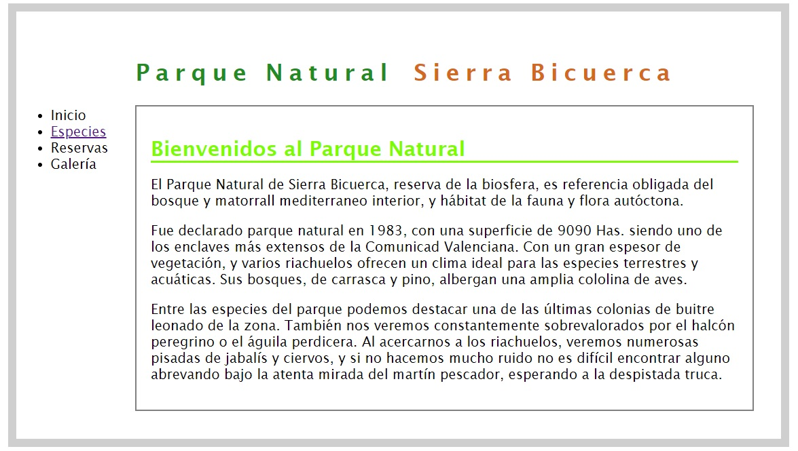
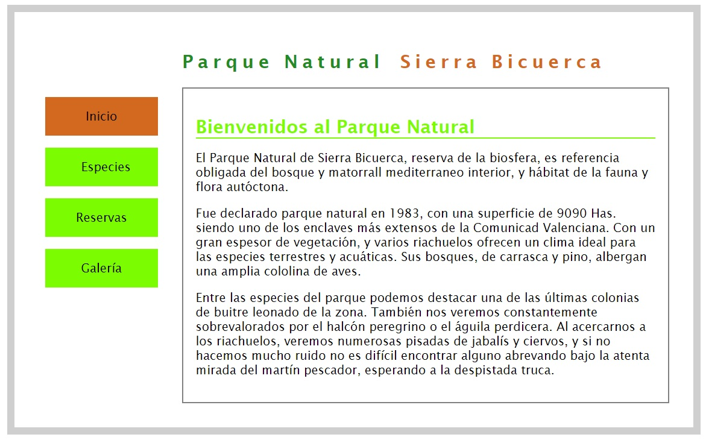
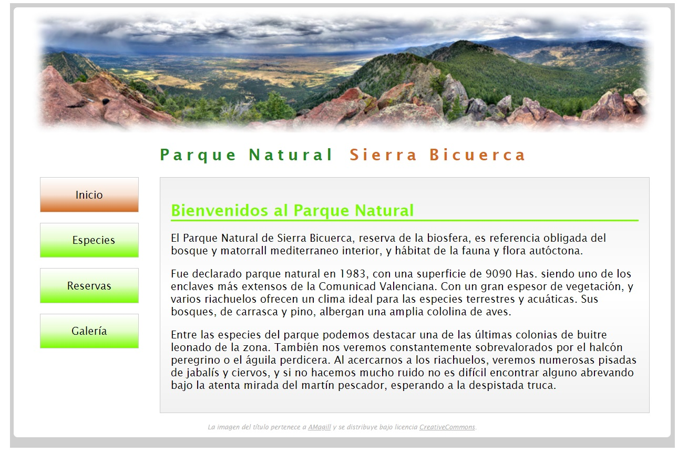

# Tareas de refuerzo HTML

## Realizamos varios retos basados en tecnología HTML y CSS
 
Los retos consisten en replicar las páginas que se muestran para cada reto.
 
Se puede ver el resultado de cada reto bien en los pantallazos o bien en el .html con los enlaces a cada uno de ellos.

### Reto 1:

### Reto 2:

### Reto 3:

### Reto 4:

### Reto 5:

### Reto 6:

### Reto 7:

### Reto 8:

### Reto 9:

### Reto 10:

